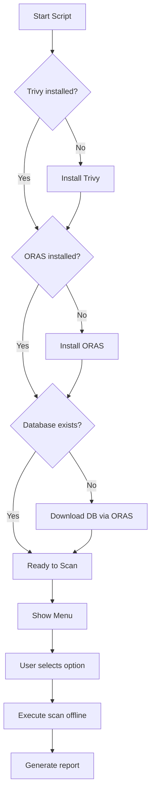

# Trivy Menu - Offline Vulnerability Scanner Manager

[](https://www.gnu.org/software/bash/)
[](https://opensource.org/licenses/MIT)
[](https://github.com/aquasecurity/trivy)

> **Interactive menu to manage and execute Trivy vulnerability scanner offline**

## 🔍 Overview

**Trivy Menu** is a comprehensive shell script that simplifies the installation, configuration, and execution of the [Trivy](https://github.com/aquasecurity/trivy) vulnerability scanner on Linux systems. It provides an intuitive interactive menu that automates the entire workflow while solving the common issue of database update failures due to censorship or network restrictions.

### 🚨 The Problem We Solve

By default, Trivy attempts to update its vulnerability database on every scan. This process often **fails** due to:
- Network censorship (especially when using **Tor** or certain **VPNs**)
- Firewall restrictions
- Unstable connections

When the update fails, Trivy **breaks** and cannot perform scans - leaving your system vulnerable.

**Our solution**: Pre-download the database using ORAS, store it locally, and always use `--skip-db-update` flag to ensure reliable offline scanning.

## ✨ Features

- ✅ **One-click installation** of Trivy and ORAS
- 🔄 **Offline database management** (download and cache)
- 📊 **Pre-configured quick scan options**
- 🛠 **Custom scan command support**
- 🔐 **SHA256 verification** for all downloads
- 📈 **Version checking and automatic updates**
- 📝 **Report generation** in table or JSON format

## 🚀 Quick Start

```bash
# Clone the repository
git clone https://github.com/yourusername/trivy-menu.git
cd trivy-menu

# Make the script executable
chmod +x trivy-menu.sh

# Run the menu
./trivy-menu.sh
```

## 📋 Menu Options

| Option | Description |
|--------|-------------|
| **1** | Install/Update Trivy |
| **2** | Install ORAS (required for DB download) |
| **3** | Update Trivy Database (offline) |
| **4** | Show scan command examples |
| **5** | Run custom scan command |
| **6** | Run quick scan (pre-defined) |
| **7** | Show versions and status |
| **8** | Exit |
**Alert: For each scan, always use option 3 to use the most recent database, as Trivy does!**

## 🎯 Usage Examples

### Quick Scan
```bash
# Option 6 from menu - Choose from:
# 1) Scan /home (HIGH,CRITICAL)
# 2) Scan / (HIGH,CRITICAL)
# 3) Scan /home (ALL severities)
# 4) Scan /home (CRITICAL only)
# 5) Scan /home (JSON format)
```

### Custom Scan
```bash
# Option 5 - Enter your own command
# Example: fs --severity HIGH,CRITICAL --format table /home
```

### Manual Commands Generated
```bash
# Scan with offline database
trivy fs --severity HIGH,CRITICAL --format table \
  --output trivy-report-home.txt --skip-db-update /home

# JSON format for CI/CD
trivy fs --severity HIGH,CRITICAL --format json \
  --output trivy-report.json --skip-db-update /home
```

## 🏗️ Architecture

```
┌─────────────────────────────────────────────┐
│           TRIVY-MENU.SH                     │
├─────────────────────────────────────────────┤
│  1. Check Status                            │
│     ├── Trivy version                       │
│     ├── ORAS installation                   │
│     └── Database existence                  │
├─────────────────────────────────────────────┤
│  2. Install/Update                          │
│     ├── Download .deb from GitHub          │
│     ├── SHA256 verification                 │
│     └── dpkg installation                   │
├─────────────────────────────────────────────┤
│  3. Database Management                     │
│     ├── ORAS pull from GHCR                 │
│     ├── SHA256 verification                 │
│     └── Extract to ~/.cache/trivy/db       │
├─────────────────────────────────────────────┤
│  4. Scan Execution                          │
│     ├── Quick scan presets                  │
│     ├── Custom commands                     │
│     └── Offline mode (--skip-db-update)    │
└─────────────────────────────────────────────┘
```

## 🔧 Advanced Details

### What This Script Automates

The manual process this script replaces would require:

1. **Checking and installing dependencies** (curl, wget, dpkg, etc.)
2. **Finding the latest Trivy release** on GitHub
3. **Downloading the correct .deb package** for your architecture
4. **Verifying the checksum** of the downloaded file
5. **Installing with dpkg** and handling dependencies
6. **Installing ORAS** for database downloads
7. **Pulling the database** from GHCR using ORAS
8. **Extracting to the correct cache directory** (`~/.cache/trivy/db`)
9. **Verifying database integrity** (size > 100MB)
10. **Running scans with the correct flags** (`--skip-db-update`)
11. **Formatting and saving reports**

Without automation, this process would take **15-20 minutes** and requires knowledge of:
- GitHub API usage
- ORAS commands
- Trivy cache structure
- Package management (dpkg/apt)
- SHA256 verification

The script reduces this to **< 2 minutes** with a simple menu interface.

### Why Offline Mode is Critical

```bash
# ❌ WRONG - Will attempt online update and fail
trivy fs /home

# ✅ CORRECT - Uses local database and works offline
trivy fs --skip-db-update /home
```

**⚠️ Important**: Never run Trivy without `--skip-db-update` when:
- Using Tor network
- Behind restrictive firewalls
- In air-gapped environments
- When censorship is present

The script **always** adds this flag to ensure reliable scanning.

## 📁 File Structure

```
~/.cache/trivy/db/
├── trivy.db           # Vulnerability database (≥100MB)
└── metadata.json      # Database metadata

/tmp/
└── trivy_version_cache # Cached version information (1 hour TTL)
```

## 🛡️ Security Features

- **SHA256 verification** for all downloaded files
- **User confirmation** before installation
- **Cache-based version checking** (reduces GitHub API calls)
- **Error handling** for all critical operations
- **Color-coded output** for better visibility

## 📦 Dependencies

| Tool | Purpose | Installation |
|------|---------|--------------|
| Trivy | Vulnerability scanner | Automated by script |
| ORAS | OCI registry client | Automated by script |
| curl | File downloads | Pre-installed |
| dpkg | Package management | Pre-installed |

## 🔄 Workflow Diagram



## 🐛 Common Issues & Solutions

| Issue | Solution |
|-------|----------|
| "Trivy not found" | Use Option 1 to install |
| "Database not found" | Use Option 3 to download |
| "SHA256 mismatch" | Script will abort automatically |
| "ORAS command not found" | Use Option 2 to install |
| "Connection refused" | Check network or use offline mode |

## 📊 Report Types

| Format | Use Case |
|--------|----------|
| Table | Human-readable reports |
| JSON | CI/CD integration |
| SARIF | GitHub Advanced Security |
| HTML | Web-based reports |

## 🤝 Contributing

Feel free to submit issues, fork the repository, and create pull requests!

## 📄 License

This project is licensed under the MIT License - see the [LICENSE](LICENSE) file for details.

## 🙏 Acknowledgments
- Open source community for making security accessible

---

**⚠️ Disclaimer**: Always ensure you have permission to scan systems. This tool is for legitimate security auditing and hardening 

# Doe monero para nos ajudar: (donate XMR)
´´´bash
    87JGuuwXzoMGwQAcSD7cvS7D7iacPpN2f5bVqETbUvCgdEmrPZa12gh5DSiKKRgdU7c5n5x1UvZLj8PQ7AAJSso5CQxgjak
´´´ 

'Página oficial de segurança digital:'

https://traderprofissional.com.br/seguranca-digital.aspxpurposes only.
